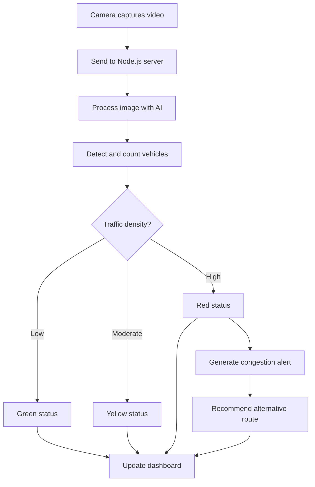

# Smart Road System: An Intelligent Traffic Monitoring Framework


## Abstract

This document presents the Smart Road System, an intelligent traffic monitoring and management solution that leverages computer vision, artificial intelligence, and real-time data analysis methodologies to enhance road safety and traffic flow efficiency. The system incorporates a comprehensive monitoring dashboard that provides visualization of traffic conditions, vehicle detection capabilities, and algorithmic route optimization during congestion events.

## System Overview

The Smart Road System has been designed to address the growing challenges of urban traffic management through technological intervention. The framework employs the following functional components:

- Integration with traffic surveillance cameras strategically positioned along transportation corridors
- Computer vision-based vehicle detection and classification using deep learning algorithms
- Quantitative analysis of traffic density patterns and congestion levels
- Geospatial representation of traffic conditions through interactive mapping technology
- Automated alert generation for anomalous traffic conditions
- Algorithmic calculation of alternative routing during high-density periods

---

## System Architecture

The system architecture employs a multi-tiered approach to data acquisition, processing, and visualization:

```
┌──────────────┐          ┌──────────────┐         ┌──────────────┐
│              │          │              │         │              │
│   ESP32-CAM  │◄────────►│   Node.js    │◄───────►│ Python AI    │
│   Cameras    │  Video   │   Server     │  Images │ Detection    │
│              │  Feed    │              │  Data   │ Service      │
└──────────────┘          └──────────────┘         └──────────────┘
                                 ▲
                                 │
                                 ▼
                          ┌──────────────┐
                          │              │
                          │   Browser    │
                          │  Dashboard   │
                          │              │
                          └──────────────┘
```

### Data Flow Architecture

The system operates through a sequential process of data acquisition, analysis, and visualization:

1. **Data Acquisition Phase**: Traffic cameras capture continuous video feeds of roadway conditions
2. **Artificial Intelligence Processing**: The computer vision subsystem analyzes the visual data to identify and classify vehicles
3. **Quantitative Analysis**: The system performs algorithmic determination of traffic density and potential anomalies
4. **Data Visualization**: The analytics dashboard presents the processed information in a comprehensible format
5. **Alert System Activation**: The system generates notifications when predefined traffic thresholds are exceeded
6. **Route Optimization**: Alternative routing suggestions are computed based on current traffic distribution

---

## Dashboard Interface

The Smart Road System incorporates an analytical dashboard that provides visualization of traffic data through multiple modalities:

| Functional Component | Technical Description |
|---------|-------------|
| **Geospatial Representation** | Interactive mapping interface with color-coded traffic condition indicators |
| **Statistical Analysis** | Quantitative representation of vehicle counts and traffic density measurements |
| **Video Feed Integration** | Real-time visual data streams from connected surveillance cameras |
| **Notification System** | Structured alert mechanism for traffic incidents and threshold violations |
| **Route Optimization Interface** | Algorithm-generated alternative routing suggestions during congestion events |
| **Cross-platform Compatibility** | Responsive design implementation for multi-device accessibility |

### Traffic Density Classification

The system employs a standardized color-coded classification scheme for traffic condition representation:

- **Green Indicator**: Optimal traffic flow conditions (minimal vehicle density, unimpeded movement)
- **Yellow Indicator**: Moderate traffic conditions (increased vehicle density, potential for reduced speeds)
- **Red Indicator**: Critical traffic conditions (high vehicle density, significant movement impediment)

---

## Technical Implementation

The Smart Road System implementation comprises several technical components that work in concert:

### Hardware Components

- **ESP32-CAM Devices**: Low-cost image acquisition modules for traffic monitoring
- **Server Infrastructure**: Computing resources for application hosting and data processing

### Software Architecture

- **Node.js Server**: Core application for managing data flow between system components
- **Python-based AI Service**: Deep learning implementation utilizing YOLOv8 for object detection
- **Web-based Dashboard**: User interface for system interaction and data visualization
- **WebSocket Protocol**: Implementation for efficient real-time data transmission

### Technological Framework

```
┌─────────────────────────────────────────┐
│                                         │
│            Smart Road System            │
│                                         │
└───────────────┬─────────────────────────┘
                │
    ┌───────────┴────────────┐
    │                        │
┌───▼───┐               ┌────▼───┐
│Backend│               │Frontend│
└───┬───┘               └────┬───┘
    │                        │
    │                        │
┌───▼──────────┐     ┌──────▼─────┐
│ Technologies  │     │Technologies│
├──────────────┤     ├────────────┤
│- Node.js     │     │- HTML      │
│- Express     │     │- CSS       │
│- WebSockets  │     │- JavaScript│
│- Python      │     │- Tailwind  │
│- YOLOv8      │     │- Leaflet   │
│- FastAPI     │     │            │
└──────────────┘     └────────────┘
```

---

## Computer Vision Classification

The artificial intelligence subsystem has been trained to identify various transportation-related entities:

| Classification Category | Entity Description | Visual Representation |
|-------|-------------|----------------|
| **Passenger Vehicle** | Standard consumer automobiles | Green boundary demarcation |
| **Commercial Transport** | Freight and goods transportation vehicles | Blue boundary demarcation |
| **Public Transit** | Mass transportation vehicles | Purple boundary demarcation |
| **Motorized Two-Wheeler** | Motorcycle classification | Orange boundary demarcation |
| **Non-motorized Two-Wheeler** | Bicycle classification | Cyan boundary demarcation |
| **Pedestrian** | Human locomotion | Red boundary demarcation |

---

## Traffic Management Methodology

The system employs the following algorithmic process for traffic condition management:



---

## System Benefits

### For Traffic Management Authorities
- **Real-time data visualization** for immediate traffic condition assessment
- **Incident detection algorithms** for rapid response coordination
- **Data-driven decision support** for traffic management optimization
- **Automated notification systems** for timely intervention

### For Transportation Network Users
- **Optimized travel duration** through enhanced routing
- **Congestion mitigation** through proactive traffic management
- **Enhanced transportation safety** through early incident identification
- **Current condition updates** for informed travel decisions

---

## Performance Metrics

| Evaluation Parameter | Quantitative Measurement |
|--------|-------------|
| **Vehicle Detection Accuracy** | 85-95% precision dependent on environmental conditions |
| **Processing Latency** | 50-200ms computational time per video frame |
| **Concurrent Camera Support** | Minimum 20 simultaneous video feeds |
| **Alert Generation Latency** | <1 second post-detection notification |
| **Interface Refresh Frequency** | Real-time updates (multiple cycles per second) |

---

## Implementation Scenarios

1. **Urban Traffic Management Applications**
   - Intersection monitoring for congestion analysis
   - Traffic signal optimization based on vehicle density algorithms
   - Rapid incident detection for safety enhancement

2. **Highway Traffic Monitoring**
   - Continuous assessment of major arterial routes
   - Early detection of traffic flow impediments
   - Route optimization during congestion events

3. **Special Event Traffic Coordination**
   - Management of increased traffic during planned gatherings
   - Parking facility allocation optimization
   - Egress traffic flow management

4. **Emergency Response Optimization**
   - Accelerated incident identification
   - Emergency vehicle pathway clearance
   - Evacuation route monitoring during safety events

---

## Future Research Directions

The Smart Road System presents numerous opportunities for further research and development:

- **Meteorological Data Integration**: Incorporation of weather condition data for routing algorithm enhancement
- **Predictive Analytics Implementation**: Development of traffic pattern forecasting capabilities
- **Emergency Vehicle Prioritization Algorithms**: Detection and routing systems for critical service vehicles
- **Traffic Signal Control Integration**: Development of automatic signal timing adjustment capabilities
- **Mobile Application Development**: Creation of user-facing mobile interfaces for route guidance

---

*Smart Road System: Advancing transportation network efficiency through applied machine learning and computer vision technologies.*